# Transferências Constitucionais para Municípios de Pernambuco

## Introdução

As transferências constitucionais são repasses obrigatórios da União
para estados e municípios, previstos na Constituição Federal.
Representam a principal fonte de receita corrente da maioria dos
municípios brasileiros, financiando desde educação básica (FUNDEB) até
compensações por desonerações tributárias.

Pernambuco, com seus 185 municípios distribuídos em 12 Regiões de
Desenvolvimento (RDs), oferece um caso rico para análise: a Região
Metropolitana de Recife concentra volume, mas o Sertão se destaca per
capita.

Nesta vinheta exploramos os dados da API de Transferências
Constitucionais do Tesouro Nacional usando o pacote `tesouror`. A
análise cobre:

1.  **Categorização** dos tipos de transferência em 5 grandes grupos
2.  **Séries históricas** anuais e mensais
3.  **Análise per capita** com dados populacionais do SICONFI
4.  **Mapas coropléticos** por município e por Região de Desenvolvimento
5.  **Análise regional** comparativa entre as 12 RDs

## Pacotes

``` r

library(tesouror)
library(tidyverse)
library(patchwork)
library(sf)
library(scales)
library(ggrepel)
library(MetBrewer)
library(glue)
```

## 1. Obtendo os dados

A função
[`get_tc_by_municipality_detail()`](https://strategicprojects.github.io/tesouror/reference/get_tc_por_municipio_detalhe.md)
retorna os repasses com granularidade de subtipo (ex: `FUNDEB/FPM`,
`Royalties/ANP`). Buscamos a série completa de 2015 a 2026 para todos os
municípios de Pernambuco.

``` r

tipos   <- get_tc_transfer_types()
estados <- get_tc_states()

pe_code <- estados |>
  filter(str_detect(nome, "(?i)pernambuco")) |>
  pull(codigo)

anos <- 2015:2026

tc_pe_raw <- get_tc_by_municipality_detail(
  state = pe_code,
  year  = anos
) |>
  rename(
    ano           = an_distribuicao,
    mes           = me_distribuicao,
    transferencia = sg_detalhe,
    valor         = total
  )
```

O pacote inclui a malha municipal de PE com Regiões de Desenvolvimento,
macrorregiões e população (Censo 2022):

``` r

pe_sf <- read_rds(system.file("data", "pernambuco_sf.rds", package = "tesouror"))

pe_lookup <- pe_sf |>
  st_drop_geometry() |>
  select(
    ibge7, municipio,
    rd           = regiao_de_desenvolvimento,
    macrorregiao, mesorregiao, populacao
  ) |>
  mutate(co_ibge = as.integer(ibge7))

pe_lookup |> count(rd, sort = TRUE)
```

## 2. Categorização das transferências

O endpoint `_detail` retorna nomes no formato `PRINCIPAL/subtipo`.
Normalizamos para o nome principal e agrupamos em 5 categorias:

| Categoria | Transferências incluídas | Lógica |
|:---|:---|:---|
| **Fundos de Participação** | FPM, FPM 1% | Principal receita corrente municipal |
| **Educação** | FUNDEB, AJUSTE FUNDEB | Financiamento da educação básica |
| **Compensações Tributárias** | CIDE, IOF-Ouro, ITR, LC 87/96, LC 176/2020, LC 201/2023 | Ressarcimento por desonerações |
| **Royalties e Recursos Naturais** | Royalties, Cessão Onerosa | Exploração de petróleo, gás e minerais |
| **Transferências Especiais** | FEX, AFM/AFE, LC 173/2020 | Auxílios emergenciais e programas específicos |

``` r

ordem_cat <- c(
  "Fundos de Participação",
  "Educação",
  "Compensações Tributárias",
  "Royalties e Recursos Naturais",
  "Transferências Especiais"
)

tc_pe <- tc_pe_raw |>
  mutate(
    transferencia_detalhe = transferencia,
    transferencia_principal = case_when(
      str_starts(transferencia, "AJUSTE FUNDEB") ~ "AJUSTE FUNDEB",
      str_starts(transferencia, "AFM/AFE")       ~ "AFM/AFE",
      str_starts(transferencia, "CIDE")          ~ "CIDE-Combustíveis",
      str_starts(transferencia, "Cessão")        ~ "Cessão Onerosa",
      str_starts(transferencia, "FPM 1%")        ~ "FPM 1%",
      str_starts(transferencia, "FPM")           ~ "FPM",
      str_starts(transferencia, "FUNDEB")        ~ "FUNDEB",
      str_starts(transferencia, "FEX")           ~ "FEX",
      str_starts(transferencia, "IOF")           ~ "IOF-Ouro",
      str_starts(transferencia, "ITR")           ~ "ITR",
      str_starts(transferencia, "LC 173")        ~ "LC 173/2020 (PFEC)",
      str_starts(transferencia, "LC 176")        ~ "LC 176/2020 (ADO25)",
      str_starts(transferencia, "LC 201")        ~ "LC 201/2023",
      str_starts(transferencia, "LC 87")         ~ "LC 87/96 (Lei Kandir)",
      str_starts(transferencia, "Royalties")     ~ "Royalties",
      TRUE                                       ~ transferencia
    ),
    categoria = factor(case_when(
      transferencia_principal %in% c("FPM", "FPM 1%")
        ~ "Fundos de Participação",
      transferencia_principal %in% c("FUNDEB", "AJUSTE FUNDEB")
        ~ "Educação",
      transferencia_principal %in% c("CIDE-Combustíveis", "IOF-Ouro", "ITR",
                                     "LC 87/96 (Lei Kandir)", "LC 176/2020 (ADO25)",
                                     "LC 201/2023")
        ~ "Compensações Tributárias",
      transferencia_principal %in% c("Royalties", "Cessão Onerosa")
        ~ "Royalties e Recursos Naturais",
      transferencia_principal %in% c("FEX", "AFM/AFE", "LC 173/2020 (PFEC)")
        ~ "Transferências Especiais",
      TRUE ~ NA_character_
    ), levels = ordem_cat),
    data = make_date(ano, mes, 1L),
    valor_milhoes = valor / 1e6
  )
```

## 3. Preparação dos dados geográficos

``` r

tc_pe <- tc_pe |>
  left_join(pe_lookup, by = "co_ibge")

tc_mun_ano <- tc_pe |>
  group_by(co_ibge, municipio, rd, macrorregiao, ano, categoria) |>
  summarise(valor = sum(valor, na.rm = TRUE), .groups = "drop")

tc_mun_total <- tc_pe |>
  group_by(co_ibge, municipio, rd, macrorregiao, ano, populacao) |>
  summarise(valor_total = sum(valor, na.rm = TRUE), .groups = "drop") |>
  mutate(valor_per_capita = valor_total / populacao)

ultimo_ano <- tc_mun_total |>
  mutate(ano = as.integer(ano)) |>
  filter(ano < max(ano)) |>
  pull(ano) |>
  max()

tc_geo <- pe_sf |>
  mutate(co_ibge = as.integer(ibge7)) |>
  left_join(
    tc_mun_total |> filter(ano == ultimo_ano) |>
      select(-macrorregiao, -municipio),
    by = "co_ibge"
  )

rd_bordas <- pe_sf |>
  filter(municipio != "Fernando de Noronha") |>
  group_by(regiao_de_desenvolvimento) |>
  summarise(geometry = st_union(geometry), .groups = "drop")
```

## 4. Paleta e tema

Usamos paletas do `MetBrewer` para consistência visual: Hokusai3 para as
5 categorias de transferência e Klimt para as 12 Regiões de
Desenvolvimento.

``` r

pal_cat   <- met.brewer("Hokusai3", 5)
cores_cat <- set_names(pal_cat, ordem_cat)

rd_nomes <- sort(unique(pe_lookup$rd))
pal_rd   <- met.brewer("Klimt", length(rd_nomes))
cores_rd <- set_names(pal_rd, rd_nomes)

tema_tc <- theme_light(base_size = 10) +
  theme(
    plot.title       = element_text(face = "bold", size = 12),
    plot.subtitle    = element_text(color = "grey40"),
    legend.position  = "bottom",
    legend.title     = element_blank(),
    panel.grid.minor = element_blank(),
    strip.text       = element_text(face = "bold"),
    axis.title.x     = element_text(margin = margin(t = 10)),
    axis.title.y     = element_text(margin = margin(r = 10))
  )

tema_mapa <- theme_void(base_size = 11) +
  theme(
    plot.title    = element_text(face = "bold", size = 11, hjust = 0.5),
    plot.subtitle = element_text(color = "grey40", size = 9, hjust = 0.5,
                                 margin = margin(b = 0, t = 5)),
    plot.caption  = element_text(color = "grey50", size = 7, hjust = 1,
                                 margin = margin(t = 10)),
    legend.position = "bottom",
    legend.title    = element_text(size = 9),
    legend.text     = element_text(size = 8),
    plot.margin     = margin(5, 5, 5, 5)
  )

guia_barra <- guide_colorbar(
  barwidth = 15, barheight = 0.5,
  title.position = "top", title.hjust = 0.5
)

repel_mapa <- list(
  size = 2.5, lineheight = 0.85, colour = "grey50",
  fill = alpha("white", 0.9), label.size = 0.15,
  label.padding = unit(0.2, "lines"),
  force = 8, force_pull = 0.3, box.padding = 1.0, point.padding = 0.5,
  segment.color = "grey30", segment.size = 0.3, segment.linetype = "solid",
  arrow = arrow(length = unit(0.015, "npc"), type = "closed"),
  min.segment.length = 0, max.overlaps = 20, seed = 42
)

# Helper: adiciona labels ggrepel com estilo padronizado dos mapas
# (ggrepel não suporta !!! do rlang, então usamos do.call)
label_mapa <- function(data, mapping) {
  do.call(geom_label_repel, c(list(data = data, mapping = mapping), repel_mapa))
}
```

## 5. Composição e séries históricas

### 5.1 Composição anual por categoria

Fundos de Participação e Educação dominam, respondendo por mais de 80%
do total. O crescimento nominal é contínuo ao longo da série.

``` r

tc_anual_cat <- tc_pe |>
  group_by(ano, categoria) |>
  summarise(valor = sum(valor, na.rm = TRUE), .groups = "drop") |>
  mutate(valor_bi = valor / 1e9)

p1 <- ggplot(tc_anual_cat, aes(ano, valor_bi, fill = categoria)) +
  geom_col(width = 0.9, alpha = 0.9) +
  scale_fill_manual(values = cores_cat) +
  scale_y_continuous(
    labels = label_number(suffix = " bi", decimal.mark = ","), expand = c(0, 0)
  ) +
  labs(
    title = glue("Transferências Constitucionais para Municípios de PE em {ultimo_ano}"),
    subtitle = "Valores nominais anuais, em R$ bilhões",
    x = "Ano", y = "Transferências"
  ) +
  scale_x_discrete(expand = c(0, 0)) + tema_tc

p2 <- ggplot(tc_anual_cat, aes(ano, valor_bi, fill = categoria)) +
  geom_col(position = "fill", width = 0.9, alpha = 0.9) +
  scale_fill_manual(values = cores_cat) +
  scale_y_continuous(labels = label_percent(), expand = c(0, 0)) +
  labs(subtitle = "Composição percentual por categoria", x = NULL, y = NULL) +
  scale_x_discrete(expand = c(0, 0)) + tema_tc

p1 / p2 + plot_layout(guides = "collect") &
  theme(legend.position = "bottom")
```

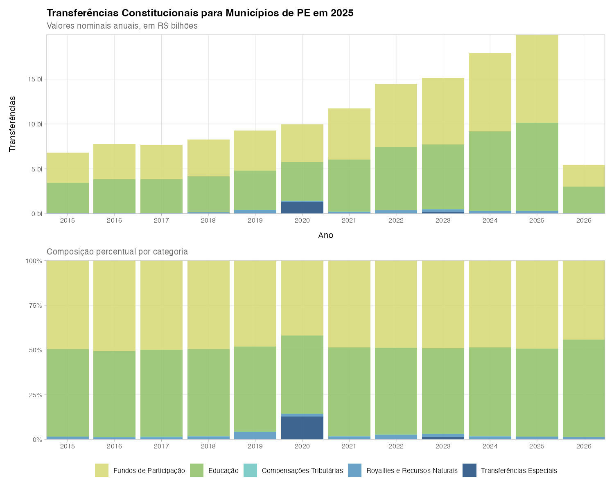

### 5.2 Séries mensais das principais categorias

A sazonalidade é marcante: dezembro e julho concentram repasses
extraordinários (decêndios adicionais de FPM e complementação FUNDEB).

``` r

tc_mensal_cat <- tc_pe |>
  group_by(data, categoria) |>
  summarise(valor = sum(valor, na.rm = TRUE), .groups = "drop") |>
  mutate(valor_milhoes = valor / 1e6)

tc_mensal_cat |>
  filter(
    data < max(data),
    !categoria %in% c("Royalties e Recursos Naturais", "Transferências Especiais")
  ) |>
  ggplot(aes(data, valor_milhoes, color = categoria)) +
  geom_line(linewidth = 0.4, alpha = 0.5) +
  geom_point(size = 0.5) +
  facet_wrap(~categoria, scales = "free_y", ncol = 1) +
  scale_color_manual(values = cores_cat) +
  scale_x_date(date_labels = "%Y", date_breaks = "1 year") +
  scale_y_continuous(labels = label_number(big.mark = ".", decimal.mark = ",")) +
  labs(title = "Principais Séries Mensais por Categoria",
       subtitle = "Valores nominais em R$ milhões",
       x = "Ano", y = "Transferências em R$ milhões") +
  tema_tc +
  theme(legend.position = "none",
        strip.background = element_rect(fill = "black", color = NA),
        strip.text = element_text(color = "white", face = "bold"))
```

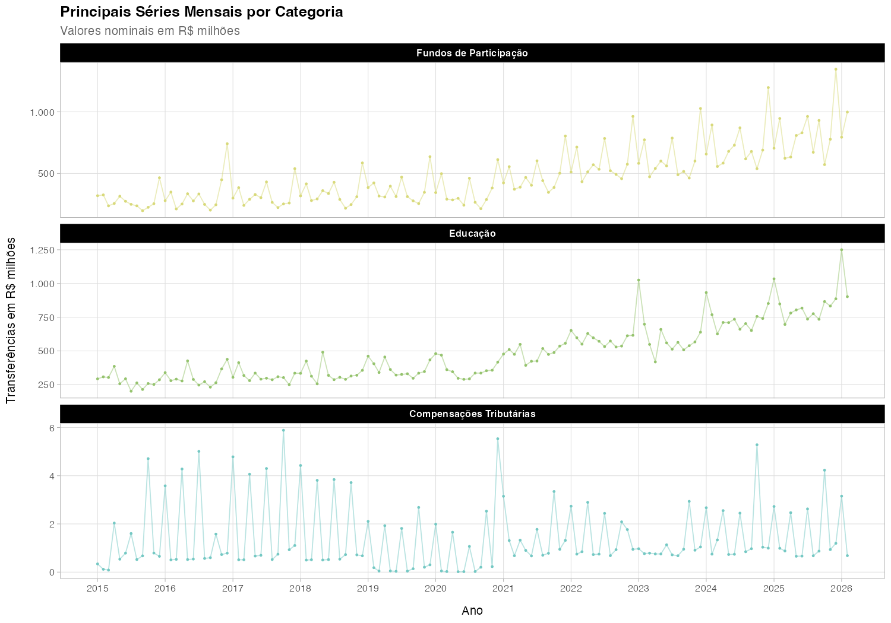

### 5.3 Top 10 municípios por volume absoluto

Os maiores centros urbanos da RMR lideram em valores absolutos.

``` r

top10_abs <- tc_mun_total |>
  mutate(ano = as.integer(ano)) |>
  filter(ano == ultimo_ano) |>
  slice_max(valor_total, n = 10)

ggplot(top10_abs, aes(valor_total / 1e6, fct_reorder(municipio, valor_total))) +
  geom_col(fill = "#2E86AB", width = 0.7) +
  geom_text(
    aes(label = paste0(
      "R$", format(round(valor_total / 1e6, 2), big.mark = ".", decimal.mark = ","), " mi"
    )),
    hjust = -0.1, size = 2.75
  ) +
  scale_x_continuous(
    expand = expansion(mult = c(0, 0.3)),
    breaks = scales::breaks_pretty(n = 10),
    labels = label_number(big.mark = ".", decimal.mark = ",")
  ) +
  labs(
    title    = glue("Top 10 Municípios — Valor Absoluto ({ultimo_ano})"),
    subtitle = "Total de transferências constitucionais em R$ milhões",
    x = "Valores em R$ milhões", y = NULL
  ) +
  scale_y_discrete(expand = c(0, 0)) +
  tema_tc +
  theme(panel.grid.major.y = element_blank())
```

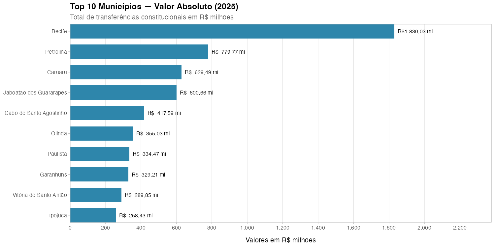

## 6. Análise per capita

A normalização por população inverte o ranking: municípios pequenos do
Sertão recebem proporcionalmente mais por habitante — o coeficiente do
FPM favorece municípios com menor população.

### 6.1 Top 10 e Bottom 10 per capita

``` r

top10_pc <- tc_mun_total |>
  mutate(ano = as.integer(ano)) |>
  filter(ano == ultimo_ano, !is.na(valor_per_capita)) |>
  slice_max(valor_per_capita, n = 10)

bot10_pc <- tc_mun_total |>
  mutate(ano = as.integer(ano)) |>
  filter(ano == ultimo_ano, !is.na(valor_per_capita)) |>
  slice_min(valor_per_capita, n = 10)

p_top <- ggplot(top10_pc, aes(valor_per_capita, fct_reorder(municipio, valor_per_capita))) +
  geom_col(fill = "#2E86AB", width = 0.7) +
  geom_text(
    aes(label = paste0("R$ ", format(round(valor_per_capita, 0), big.mark = ".", decimal.mark = ","))),
    hjust = -0.1, size = 3
  ) +
  scale_x_continuous(expand = expansion(mult = c(0, 0.35))) +
  scale_y_discrete(expand = c(0, 0)) +
  labs(title = "Top 10: Maior per capita", x = "R$ por habitante", y = NULL) +
  tema_tc + theme(plot.title = element_text(size = 9)) +
  theme(panel.grid.major.y = element_blank())

p_bot <- ggplot(bot10_pc, aes(valor_per_capita, fct_reorder(stringr::str_wrap(municipio, 12), valor_per_capita))) +
  geom_col(fill = "#C73E1D", width = 0.7) +
  geom_text(
    aes(label = paste0("R$ ", format(round(valor_per_capita, 0), big.mark = ".", decimal.mark = ","))),
    hjust = -0.1, size = 3
  ) +
  scale_x_continuous(expand = expansion(mult = c(0, 0.35))) +
  scale_y_discrete(expand = c(0, 0)) +
  labs(title = "Bottom 10: Menor per capita",
       x = "R$ por habitante", y = NULL) +
  tema_tc + theme(plot.title = element_text(size = 9))  +
  theme(panel.grid.major.y = element_blank())

p_top + p_bot +
  plot_annotation(
    title    = "Transferências Constitucionais Per Capita",
    subtitle = "R$ por habitante"
  )
```

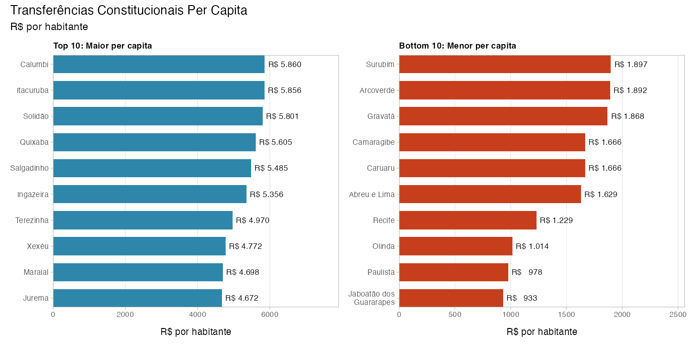

### 6.2 Evolução per capita ao longo do tempo

``` r

tc_anual_pc <- tc_mun_total |>
  filter(!is.na(populacao)) |>
  group_by(ano) |>
  summarise(valor_total = sum(valor_total, na.rm = TRUE),
            populacao = sum(populacao, na.rm = TRUE), .groups = "drop") |>
  mutate(per_capita = valor_total / populacao, ano = as.integer(ano)) |>
  filter(ano < max(ano))

ggplot(tc_anual_pc, aes(ano, per_capita)) +
  geom_line(color = "#2E86AB", linewidth = 1) +
  geom_point(color = "#2E86AB", size = 2.5) +
  scale_x_continuous(breaks = function(x) seq(min(x), max(x), by = 1),
                     labels = label_number(big.mark = "", accuracy = 1)) +
  scale_y_continuous(
    labels = label_number(big.mark = ".", decimal.mark = ","),
    breaks = scales::breaks_pretty(n = 10)) +
  labs(title = "Transferências Per Capita: Total PE ao Longo do Tempo",
       subtitle = "R$ por habitante/ano", x = "Ano", y = "R$ per capita") +
  tema_tc
```

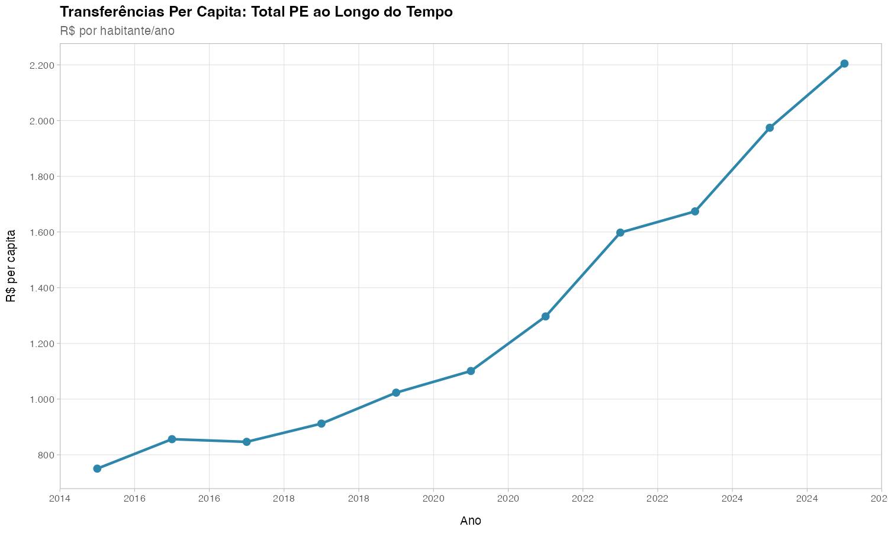

### 6.3 Mapas: absoluto vs per capita

No mapa absoluto a RMR domina. No per capita, os municípios do Sertão se
destacam. A escala logarítmica no absoluto é essencial: Recife recebe
~50x mais que municípios pequenos.

``` r

tc_geo_cont <- tc_geo |> filter(municipio != "Fernando de Noronha")
bbox <- st_bbox(tc_geo_cont)

centroides_abs <- tc_geo_cont |>
  st_centroid() |> slice_max(valor_total, n = 8, na_rm = TRUE) |>
  mutate(x = st_coordinates(geometry)[, 1], y = st_coordinates(geometry)[, 2],
         label = paste0(municipio, "\nR$ ", round(valor_total / 1e6, 0), " mi"))

centroides_pc <- tc_geo_cont |>
  st_centroid() |> slice_max(valor_per_capita, n = 8, na_rm = TRUE) |>
  mutate(x = st_coordinates(geometry)[, 1], y = st_coordinates(geometry)[, 2],
         label = paste0(municipio, "\nR$ ", format(round(valor_per_capita, 0),
                                                    big.mark = ".", decimal.mark = ",")))
```

``` r

ggplot() +
  geom_sf(data = tc_geo_cont, aes(fill = valor_total / 1e6),
          color = "grey70", linewidth = 0.05) +
  geom_sf(data = rd_bordas, fill = NA, color = "grey30", linewidth = 0.4) +
  coord_sf(xlim = c(bbox["xmin"] - 0.05, bbox["xmax"] + 0.05),
           ylim = c(bbox["ymin"] - 0.05, bbox["ymax"] + 0.25), expand = FALSE) +
  label_mapa(centroides_abs, aes(x = x, y = y, label = label)) +
  scale_fill_viridis_c(
    option = "inferno", name = "R$ milhões", trans = "log10",
    labels = label_number(big.mark = ".", decimal.mark = ","),
    breaks = c(1, 5, 10, 50, 200, 1000),
    na.value = "grey90", direction = -1, guide = guia_barra) +
  labs(title = "Transferências Constitucionais — Valor Absoluto",
       subtitle = glue("Total {ultimo_ano} (R$ milhões, escala log)"),
       caption = "Fonte: Tesouro Nacional/tesouror") +
  tema_mapa
```

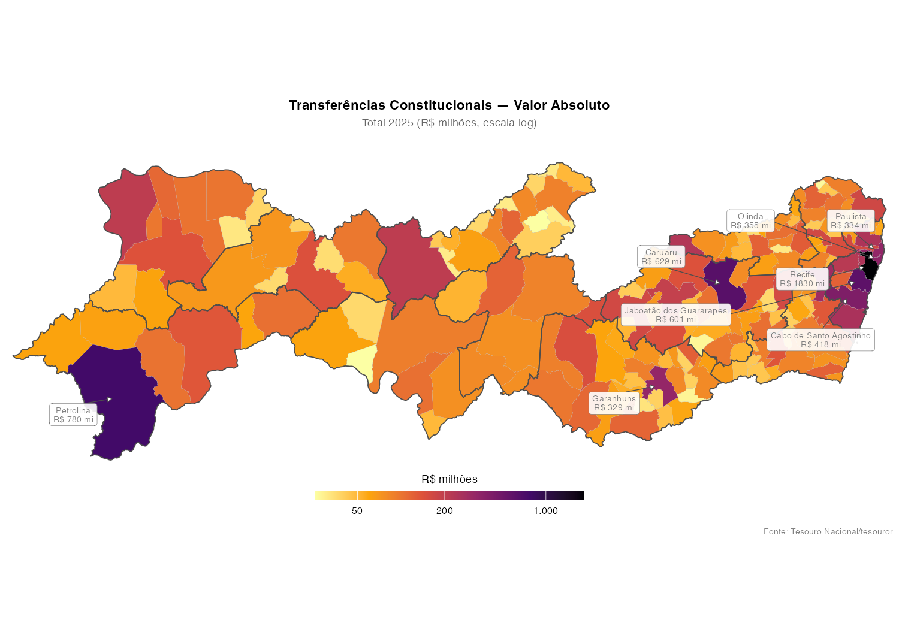

``` r

ggplot() +
  geom_sf(data = tc_geo_cont |> filter(!is.na(valor_per_capita)),
          aes(fill = valor_per_capita), color = "grey70", linewidth = 0.05) +
  geom_sf(data = rd_bordas, fill = NA, color = "grey30", linewidth = 0.4) +
  coord_sf(xlim = c(bbox["xmin"] - 0.05, bbox["xmax"] + 0.05),
           ylim = c(bbox["ymin"] - 0.05, bbox["ymax"] + 0.25), expand = FALSE) +
  label_mapa(centroides_pc, aes(x = x, y = y, label = label)) +
  scale_fill_viridis_c(
    option = "mako", name = "R$ per capita", direction = -1, na.value = "grey90",
    labels = label_number(big.mark = ".", decimal.mark = ","), guide = guia_barra) +
  labs(title = "Transferências Constitucionais — Per Capita",
       subtitle = glue("Total {ultimo_ano} (R$ por habitante)"),
       caption = "Malha: IBGE | População: SICONFI") +
  tema_mapa
```

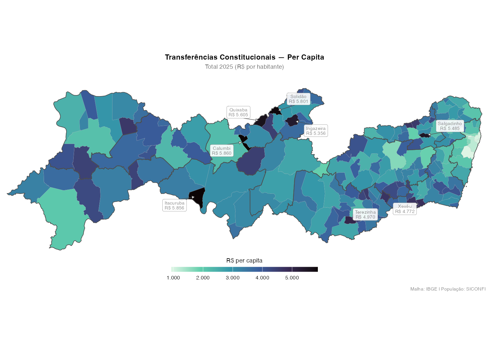

### 6.4 Mapa de referência: Regiões de Desenvolvimento

``` r

rd_bordas_proj <- rd_bordas |> st_transform(31985)
bbox_bordas    <- st_bbox(rd_bordas_proj)

centroides_bordas <- rd_bordas_proj |>
  st_centroid() |>
  mutate(x = st_coordinates(geometry)[, 1], y = st_coordinates(geometry)[, 2],
         label = regiao_de_desenvolvimento)

ggplot(rd_bordas_proj) +
  geom_sf(aes(fill = regiao_de_desenvolvimento), color = "white", linewidth = 0.3) +
  geom_label_repel(
    data = centroides_bordas, aes(x = x, y = y, label = label),
    size = 2.5, lineheight = 0.85, colour = "grey20",
    fill = alpha("white", 0.85), label.size = 0.15,
    label.padding = unit(0.15, "lines"),
    segment.color = "grey40", segment.size = 0.3,
    min.segment.length = 0.2, seed = 42, max.overlaps = 15) +
  scale_fill_manual(values = cores_rd) +
  coord_sf(xlim = c(bbox_bordas["xmin"] - 5000, bbox_bordas["xmax"] + 5000),
           ylim = c(bbox_bordas["ymin"], bbox_bordas["ymax"] + 15000),
           expand = FALSE) +
  labs(title = "Regiões de Desenvolvimento de Pernambuco",
       subtitle = "12 RDs definidas pela CONDEPE/FIDEM") +
  tema_mapa + theme(legend.position = "none")
```

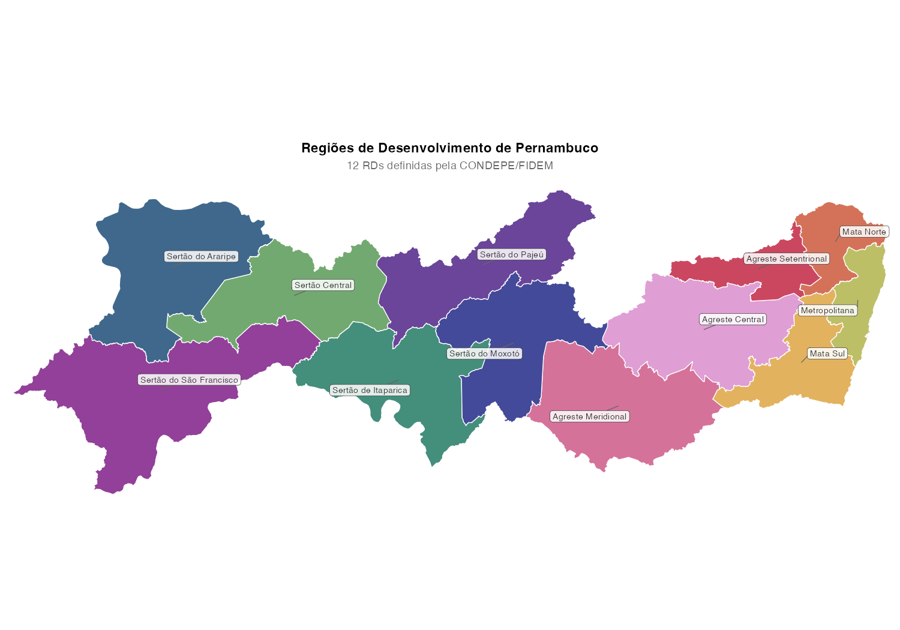

## 7. Análise por Região de Desenvolvimento

### 7.1 Série temporal por RD

A Metropolitana concentra o maior volume, seguida pelo Agreste Central
(polo de Caruaru) e Mata Sul.

``` r

tc_rd <- tc_pe |> filter(!is.na(rd))

tc_rd_anual <- tc_rd |>
  group_by(ano, rd) |>
  summarise(valor = sum(valor, na.rm = TRUE), .groups = "drop") |>
  mutate(valor_bi = valor / 1e9)

ggplot(tc_rd_anual, aes(ano, valor_bi, fill = rd)) +
  geom_col(width = 0.7) +
  scale_fill_manual(values = cores_rd) +
  scale_y_continuous(labels = label_number(suffix = " bi", decimal.mark = ","),
                     breaks = scales::breaks_pretty(n = 10),
                     expand = c(0, 0)) +
  labs(title = "Transferências por Região de Desenvolvimento",
       subtitle = "Valores nominais anuais, em R$ bilhões", x = NULL, y = "R$") +
  tema_tc + guides(fill = guide_legend(nrow = 3, byrow = TRUE))
```

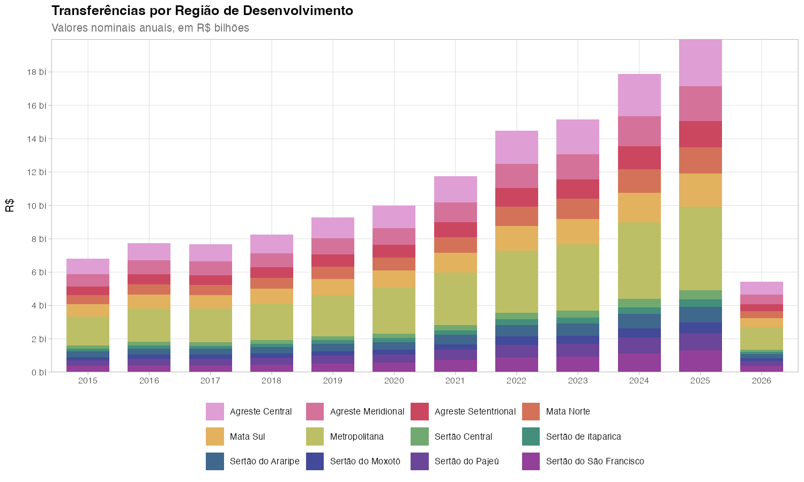

### 7.2 Composição por categoria dentro de cada RD

``` r

tc_rd_cat <- tc_rd |>
  filter(ano == ultimo_ano) |>
  group_by(rd, categoria) |>
  summarise(valor = sum(valor, na.rm = TRUE), .groups = "drop") |>
  mutate(valor_mi = valor / 1e6)

ggplot(tc_rd_cat, aes(valor_mi, fct_reorder(rd, valor_mi, .fun = sum), fill = categoria)) +
  geom_col(width = 0.7) +
  scale_fill_manual(values = cores_cat) +
  scale_x_continuous(
    labels = label_number(big.mark = ".", decimal.mark = ","),
    breaks = scales::breaks_pretty(n = 10),
    expand = c(0,0)) +
  labs(title = glue("Composição por RD — {ultimo_ano}"),
       subtitle = "R$ milhões, por categoria de transferência", x = "R$ milhões", y = NULL) +
  tema_tc
```

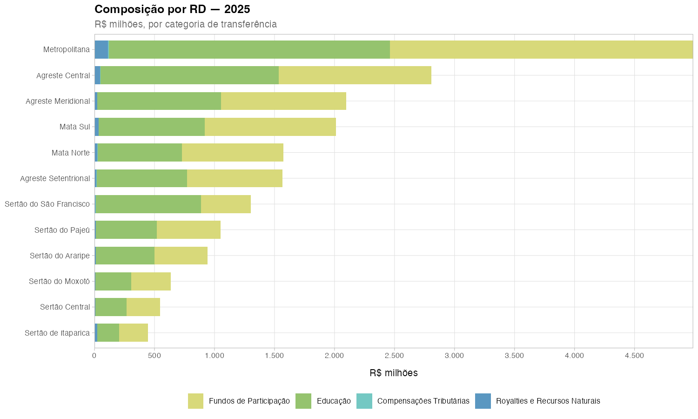

### 7.3 Per capita por RD

As RDs do Sertão (Moxotó, Pajeú, Araripe) recebem significativamente
mais per capita que a Metropolitana.

``` r

rd_pop <- pe_lookup |> group_by(rd) |> summarise(populacao = sum(populacao))

tc_rd_pc <- tc_rd |>
  filter(ano == ultimo_ano) |>
  group_by(rd) |>
  summarise(n_mun = n_distinct(co_ibge), valor_total = sum(valor, na.rm = TRUE),
            .groups = "drop") |>
  left_join(rd_pop, by = "rd") |>
  mutate(per_capita = valor_total / populacao)

ggplot(tc_rd_pc, aes(per_capita, fct_reorder(rd, per_capita))) +
  geom_col(aes(fill = rd), width = 0.8, show.legend = FALSE) +
  geom_text(aes(label = paste0("R$ ", format(round(per_capita, 0),
                                              big.mark = ".", decimal.mark = ","),
                                "  (", n_mun, " mun.)")),
            hjust = -0.05, size = 3) +
  scale_fill_manual(values = cores_rd) +
  scale_x_continuous(expand = expansion(mult = c(0, 0.35))) +
  labs(
    title    = "Transferência Per Capita por Região de Desenvolvimento",
    subtitle = glue("{ultimo_ano} R$ por habitante"),
    x = "R$ por habitante", y = NULL
  ) +
  tema_tc +
  theme(panel.grid.major.y = element_blank())
```

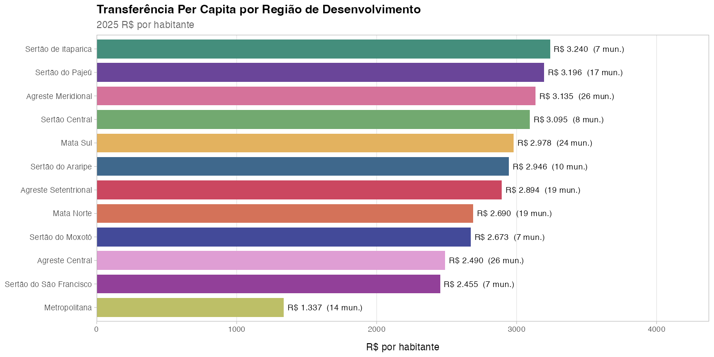

### 7.4 Evolução per capita por RD

A distância entre Sertão e Metropolitana se mantém relativamente estável
ao longo da década — o mecanismo redistributivo não está reduzindo a
disparidade per capita.

``` r

tc_rd_pc_serie <- tc_rd |>
  group_by(ano, rd) |>
  summarise(valor_total = sum(valor, na.rm = TRUE), .groups = "drop") |>
  left_join(rd_pop, by = "rd") |>
  mutate(per_capita = valor_total / populacao, ano = as.integer(ano)) |>
  filter(ano < max(ano))

ggplot(tc_rd_pc_serie, aes(ano, per_capita, color = rd)) +
  geom_line(linewidth = 0.7) + geom_point(size = 1.2) +
  scale_color_manual(values = cores_rd) +
    scale_y_continuous(
    labels = label_number(big.mark = ".", decimal.mark = ","),
    breaks = scales::breaks_pretty(n = 8)) +
  scale_x_continuous(
    breaks = function(x) seq(min(x), max(x), by = 1),
    labels = label_number(big.mark = "", accuracy = 1),
    expand = c(0.01,0.01)
  ) +
  labs(
    title    = "Evolução das Transferências Per Capita por RD",
    subtitle = "R$ por habitante/ano",
    x = "Ano", y = "R$ per capita"
  ) +
  tema_tc +
  guides(color = guide_legend(nrow = 3, byrow = TRUE))
```

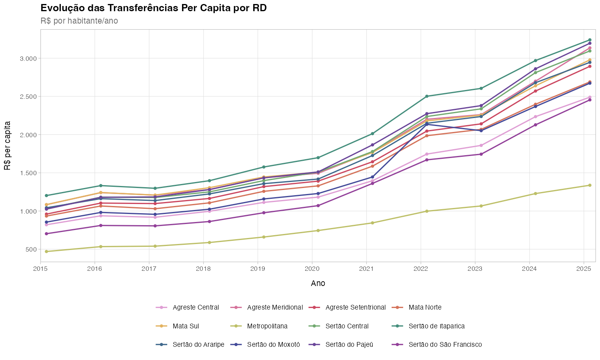

### 7.5 Mapa per capita por RD

``` r

tc_rd_pc_geo <- rd_bordas |>
  left_join(tc_rd_pc, by = c("regiao_de_desenvolvimento" = "rd"))

centroides_rd <- tc_rd_pc_geo |>
  st_centroid() |>
  mutate(x = st_coordinates(geometry)[, 1], y = st_coordinates(geometry)[, 2],
         label = paste0(regiao_de_desenvolvimento, "\nR$ ",
                        format(round(per_capita, 1), big.mark = ".", decimal.mark = ",")))

ggplot() +
  geom_sf(data = tc_rd_pc_geo, aes(fill = per_capita),
          color = "white", linewidth = 0.4) +
  label_mapa(centroides_rd, aes(x = x, y = y, label = label)) +
  coord_sf(xlim = c(bbox["xmin"] - 0.05, bbox["xmax"] + 0.05),
           ylim = c(bbox["ymin"] - 0.05, bbox["ymax"] + 0.25), expand = FALSE) +
  scale_fill_distiller(palette = "YlGnBu", direction = 1, name = "R$ per capita",
                       labels = label_number(big.mark = ".", decimal.mark = ","),
                       guide = guia_barra) +
  labs(title = "Transferências Per Capita por Região de Desenvolvimento",
       subtitle = glue("{ultimo_ano} — R$ por habitante/ano"),
       caption = "Fonte: Tesouro Nacional/tesouror | CONDEPE/FIDEM") +
  tema_mapa
```

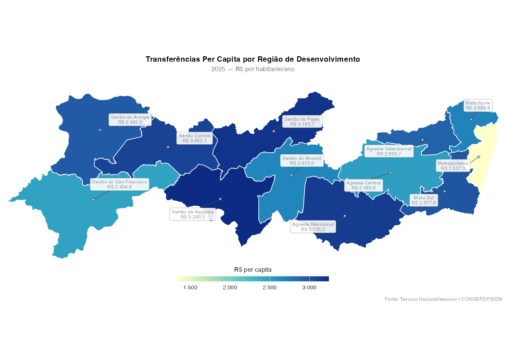

## 8. Mapas por categoria de transferência

Cada painel mostra a distribuição espacial de uma das 5 categorias. Note
como os Royalties se concentram em poucos municípios, enquanto o FPM tem
distribuição mais homogênea.

``` r

tc_cat_geo <- tc_mun_ano |>
  filter(ano == ultimo_ano) |>
  right_join(pe_sf |> mutate(co_ibge = as.integer(ibge7)) |> select(co_ibge, geometry),
             by = "co_ibge") |>
  st_as_sf() |>
  mutate(valor_mi = valor / 1e6) |>
  filter(municipio != "Fernando de Noronha")

ggplot(tc_cat_geo) +
  geom_sf(aes(fill = valor_mi), color = "grey80", linewidth = 0.03) +
  geom_sf(data = rd_bordas, fill = NA, color = "grey30", linewidth = 0.3) +
  facet_wrap(~categoria, ncol = 2) +
  scale_fill_viridis_c(
    option = "mako", name = "R$ mi", trans = "log10",
    labels = label_number(big.mark = ".", decimal.mark = ","),
    na.value = "grey90", direction = -1, guide = guia_barra) +
  labs(title = "Distribuição Espacial por Categoria de Transferência",
       subtitle = glue("{ultimo_ano} — escala logarítmica"),
       caption = "Fonte: Tesouro Nacional/tesouror") +
  tema_mapa + theme(strip.text = element_text(face = "bold", size = 9))
```

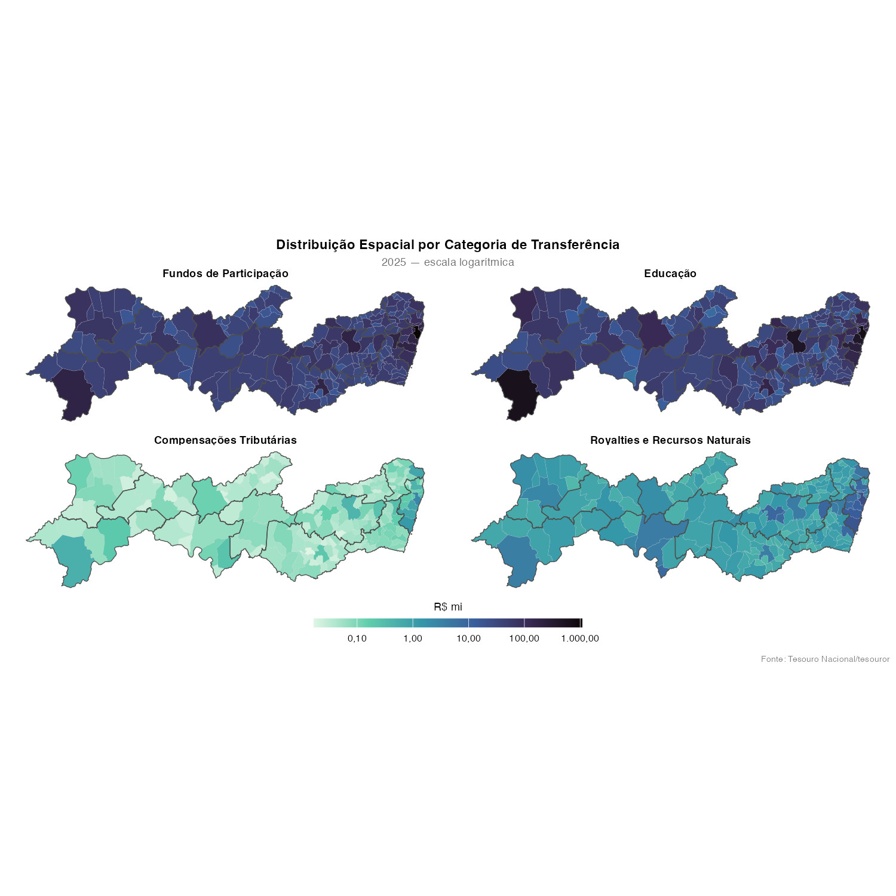

## Considerações finais

- **FPM e FUNDEB dominam**: juntos representam mais de 80% do total, com
  sazonalidade marcante (picos em julho e dezembro).
- **O mapa muda radicalmente com per capita**: grandes centros dominam
  em absoluto, mas o Sertão se destaca por habitante.
- **As 12 RDs revelam desigualdades persistentes**: a distância per
  capita entre Sertão e Metropolitana não se reduziu na década.
- **Royalties são altamente concentrados**: apenas alguns municípios
  recebem valores significativos.

### Próximos passos

- Deflacionar pelo IPCA para análise em termos reais
- Incorporar dados do SIOPE para cruzar com gastos em educação
- Modelar previsões para projetar receita municipal
- Correlacionar per capita com indicadores socioeconômicos (IDH,
  pobreza)

## Referências

- Tesouro Nacional — API de Transferências Constitucionais:
  <https://apiapex.tesouro.gov.br/aria/v1/transferencias_constitucionais/docs>
- CONDEPE/FIDEM — Regiões de Desenvolvimento de Pernambuco
- MetBrewer — Paletas de cores:
  <https://github.com/BlakeRMills/MetBrewer>
